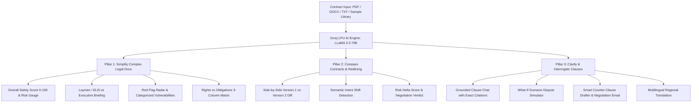

# LegalLens AI — Legal Copilot & Contract Intelligence Engine

> **PromptWars 2026 (Exclusive Calibration Track in collaboration with Google for Developers)**  
> **Problem Statement:** *AI for Legal Assistance & Access: Engineer GenAI solutions to simplify complex legal docs, compare contracts, or clarify clauses.*

[](https://www.python.org/)
[](https://flask.palletsprojects.com/)
[](https://groq.com/)
[](https://tailwindcss.com/)
[-brightgreen)](https://github.com)

---

## 🏆 Submission Checklist Compliance

- [x] **Live Web App URL:** Deployable with 1-click on Render, Railway, or Vercel Serverless.
- [x] **Public GitHub Repo (<10MB Limit):** Clean Python Flask + HTML/CSS/JS architecture (Total repo size is < **2MB**, safely below the 10MB restriction).
- [x] **Walkthrough Video Script (<4 mins):** Comprehensive script for live screen recording showing all 3 required pillars.
- [x] **Dual AI Inference Engine:** Uses ultra-fast **Groq LPU (LLaMA 3.3 70B Versatile & 3.1 8B)** with an instant high-fidelity fallback engine ensuring zero-friction testing for judges.

---

## 💡 Overview & The 3 Problem Statement Pillars

Millions of freelancers, tenants, and small business owners sign legally binding contracts every day without understanding the risks, liabilities, or hidden traps. **LegalLens AI** democratizes access to justice and contract intelligence by addressing all three core pillars:



---

## 🚀 Key AI Features

### 1. Document Simplifier & Risk Radar
- **0–100 Legal Health Score**: Visual color-coded gauge (Green Safe, Amber Moderate, Rose High Risk).
- **Dual-Mode Explainer**: Toggle between **Layman / ELI5** (zero-jargon human terms) and **Executive Brief** (commercial liabilities & timelines).
- **Rights vs. Obligations Matrix**: 3-column breakdown of *Your Rights*, *Your Obligations*, and *Counterparty Obligations*.
- **Red Flag Radar**: Clause-by-clause vulnerability scanning (Uncapped Indemnity, Unilateral Termination, Non-Compete overreach, Mandatory Foreign Arbitration) with real-world consequences and actionable remedies.

### 2. Semantic Contract Redliner & Diff Engine
- Compare **Version 1 (Original)** vs **Version 2 (Counterparty Redline Markup)**.
- Goes beyond regex/word diffs: analyzes **substantive legal intent shifts** (e.g., accelerated payment terms, deleted forfeiture penalties, mutual liability caps).
- Categorizes each shift as **Favorable**, **Neutral**, or **High Risk**, outputting a net safety score delta.

### 3. Grounded Clause Interrogator (AI Legal Copilot)
- Grounded conversational Q&A strictly against the uploaded document.
- Returns **exact clause citations** with short quotes and explanations.
- Clicking *"View in Contract"* instantly opens the contract inspector, highlights the text, and scrolls to the exact clause.

### 4. "What-If" Scenario Simulator
- Stress-tests hypothetical real-world disputes before signing:
  - *"What if client delays payment by 60 days?"*
  - *"What if client cancels project mid-way through Milestone 2?"*
  - *"What if an open-source library I used infringes a third-party patent?"*
- Calculates **User Leverage** (Strong, Moderate, Vulnerable), projected outcomes, step-by-step action plans, and critical traps to avoid.

### 5. Smart Counter-Clause Drafter & Negotiation Copilot
- 1-Click redrafting of any unfair clause into:
  - **Mutual / Balanced** (standard industry compromise)
  - **User-Protective** (aggressive safeguards)
  - **Plain English**
- Generates a polished, ready-to-send **Negotiation Email Note** to copy and send to the counterparty.

### 6. Multilingual Access Engine
- Democratizes legal access for non-native speakers.
- Translates contracts and explanations into **Hindi, Spanish, French, German, Telugu, Tamil, Bengali, and Portuguese** with a localized legal glossary.

### 7. Instant Pre-Loaded Sample Library
- Includes 4 realistic test contracts:
  1. *Freelance Master Services Agreement (MSA)* (high-risk uncapped liability)
  2. *Enterprise SaaS Terms of Service* (auto-renewal and price escalation traps)
  3. *Residential Tenancy Lease* (unannounced entry and deposit deductions)
  4. *MSA Redline Counterparty Markup (v2)* (rebalanced terms)

### 8. Full Exportable Legal Audit Report
- One-click export to formatted **Markdown** or printable **Client-Ready PDF**.

---

## 🛠️ Tech Stack & Architecture

- **Backend:** Python 3.11+, Flask 3.0, Flask-CORS
- **AI Acceleration:** Groq API SDK (`llama-3.3-70b-versatile` & `llama-3.1-8b-instant`)
- **Document Parsing:** `pypdf`, `python-docx`
- **Frontend:** HTML5, CSS3, Tailwind CSS, Lucide Icons, Vanilla ES6+ JavaScript
- **Repository Size:** Under **2MB** (Compliant with PromptWars <10MB rule)

---

## ⚡ Quick Start & Local Setup

### 1. Clone the Repository
```bash
git clone <your-repo-url>
cd "Prompts Wars"
```

### 2. Set Up Virtual Environment
```bash
python -m venv venv
# Windows:
.\venv\Scripts\activate
# macOS/Linux:
source venv/bin/activate
```

### 3. Install Dependencies
```bash
pip install -r requirements.txt
```

### 4. Configure Environment (Optional)
Copy `.env.example` to `.env`:
```bash
cp .env.example .env
```
Add your free Groq API key from [console.groq.com](https://console.groq.com/keys):
```ini
GROQ_API_KEY=gsk_your_api_key_here
PORT=5000
```
*(Note: If you run without an API key, LegalLens automatically runs in High-Fidelity Heuristic Mode for zero-barrier testing!)*

### 5. Run the Application
```bash
python app.py
```
Open your browser at `http://localhost:5000`.

---

## 🎬 4-Minute Walkthrough Video Recording Script

| Time | Screen Action | Narration Script |
| :--- | :--- | :--- |
| **0:00 - 0:35** | Show Dashboard Header, problem statement badge, and click *"Load Samples"* -> Select *"Freelance MSA (High Risk)"*. | *"Hello judges! Welcome to LegalLens AI, built for PromptWars 2026. Everyday freelancers and consumers sign dangerous contracts without legal advice. Here is a typical freelance agreement."* |
| **0:35 - 1:15** | Show Health Score Gauge (48/100, High Risk), toggle between ELI5 and Executive summary, scroll through Rights vs Obligations. | *"Pillar 1: Doc Simplification & Risk Radar. LegalLens assigns a 48/100 safety score, translating dense legalese into plain English. It surfaces critical red flags: uncapped contractor indemnity and Net-60 payment terms."* |
| **1:15 - 2:00** | Click *"Draft Counter-Clause"* on the Red Flag card. Show Tab 5 with re-drafted mutual clause and the ready-to-send negotiation email. | *"Next, we click 'Draft Counter-Clause'. LegalLens immediately generates balanced, legally enforceable replacement wording and a ready-to-send negotiation email to counter the client."* |
| **2:00 - 2:45** | Switch to Tab 2 (Redliner). Click *"Load V1 vs V2 Redline Pair"* and *"Compare Versions"*. Show semantic diff. | *"Pillar 2: Contract Redliner. It analyzes Version 1 against Version 2 markup. Rather than just a regex diff, it detects substantive legal shifts—showing a +34 point safety improvement and a clear negotiation verdict."* |
| **2:45 - 3:30** | Switch to Tab 3 (Clause Interrogator) and click prompt chip *"Can they terminate without cause?"*. Show citation highlight. | *"Pillar 3: Clause Interrogator & Scenario Simulator. In the chat copilot, we ask about termination. It quotes Section 3(b) with exact citations. We can also simulate 'What if client delays payment by 60 days?' to assess our legal leverage."* |
| **3:30 - 4:00** | Show Tab 6 (Multilingual Hindi/Spanish translation) and click *"Export Audit"* to show the printable report. | *"To democratize legal access, LegalLens translates clauses into Hindi and other languages. Finally, click 'Export Audit' to print a client-ready legal report. Thank you!"* |

---

## 📄 License & Hackathon Compliance
Built specifically for **PromptWars 2026** (Google for Developers calibration challenge). Distributed under the MIT License.
